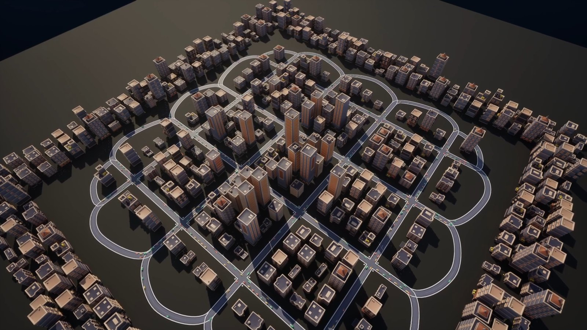
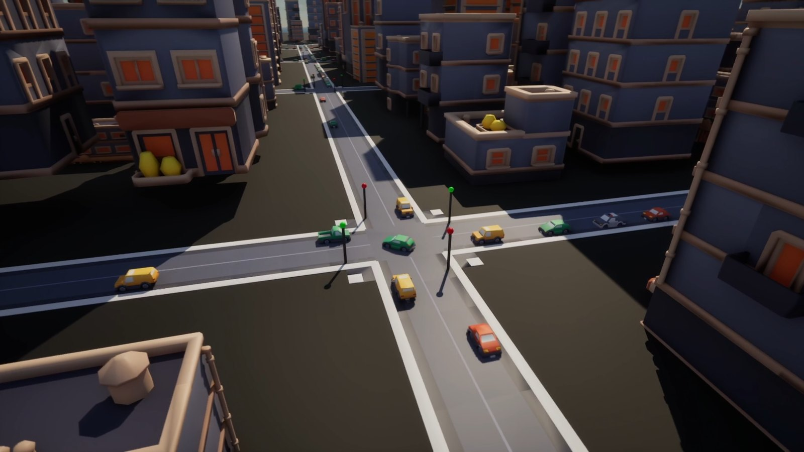
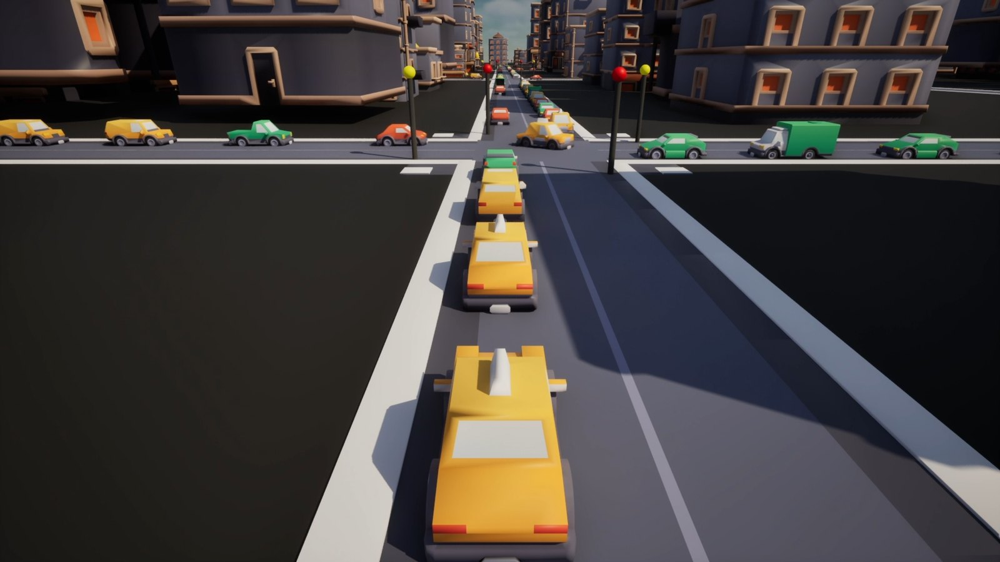

# Traffic Simulation Plugin for Unreal Engine 5

An Actor-based traffic simulation plugin for Unreal Engine 5: spline road
networks, signalised junctions with real right-of-way arbitration, car
following, and the observability tooling to see why the traffic is doing what
it is doing.

Built for projects that want believable street traffic without adopting an
ECS. Everything is an ordinary Actor, configured in the details panel and
driven from Blueprint or C++.

*Roads, junctions, signals, connections, buildings, vehicles and cameras —
all generated by one button on `ATrafficDemoSceneBuilder`.*

> **Status:** working prototype under active development. The simulation and
> tooling described below are implemented and tested; see
> [Limitations](#limitations) for what it deliberately does not do.

---

## Contents

- [Why this exists](#why-this-exists)
- [Features](#features)
- [Quick start](#quick-start)
- [How it works](#how-it-works)
- [Configuration reference](#configuration-reference)
- [Benchmarks](#benchmarks)
- [Running the tests](#running-the-tests)
- [Limitations](#limitations)
- [Roadmap](#roadmap)
- [Requirements](#requirements)
- [Licence](#licence)

---

## Why this exists

Unreal already ships a large-scale traffic system in the CitySample project,
built on Mass Entity and ZoneGraph. It is impressive and it scales to a city.
It is also sample content rather than a supported drop-in plugin, and using it
means adopting an ECS architecture and learning its tooling.

Most projects that want traffic are not building CitySample. They want a few
hundred believable vehicles on a handful of streets, configured by designers,
inspectable when something looks wrong.

This plugin targets that case:

| | This plugin | MassTraffic / ZoneGraph |
|---|---|---|
| Architecture | Ordinary Actors | Mass Entity (ECS) |
| Configuration | Details panel, Blueprint | ECS traits and configs |
| Scale | Hundreds | Tens of thousands |
| Learning curve | Place an actor, press a button | Learn Mass |
| Form | Plugin | Sample project content |

**It is not a MassTraffic replacement.** If you need city-scale crowds, use
Mass. This is the option for the far more common case where you need traffic
that reads convincingly and can be reasoned about.

---

## Features

**Road network**
- Spline-based roads with configurable lane count, width and driving side
- Lanes addressed by stable `FGuid`-based handles that survive regeneration
- Automatic endpoint-proximity connection, with validation reporting

**Junctions**
- Connector lanes generated as Bezier curves between approaches, sampled by
  true arc length so vehicles hold a constant speed through a turn
- Turn classification (left / straight / right / U-turn) from geometry
- Conflict matrix built from actual path crossings, merges and near-misses
- Deadlock-free FIFO arbitration with per-pair conflict clearance, so a
  vehicle only blocks the movements it is genuinely in the way of
- "Don't block the box": entry is refused unless the exit lane has room
- Multi-phase traffic signals with clearance intervals and visible lights

**Vehicles**
- Gipps-style safe-speed car following, aware of the leader's speed
- Time-headway spacing, so gaps scale with speed
- Weighted vehicle variants (sedan, taxi, lorry…) with per-type speed, and
  following gaps derived from each mesh's actual length

**Tooling**
- Procedural scene builder: any *N*×*M* junction grid with a perimeter ring,
  buildings, vehicles and cameras from one button
- Debug overlay: per-vehicle state, leader links, signal state, network
  summary, with selectable verbosity
- Congestion experiment: scripted signal restriction with CSV output
- Benchmark runner: sweeps population sizes and measures simulation cost
  independently of frame rate
- Camera rig with framed overview, junction orbit and chase shots

---

## Quick start

### 1. Install

Copy the `Plugins/TrafficSimulation` folder into your project's `Plugins`
directory and regenerate project files. The plugin has both a runtime and an
editor module and enables itself on load.

### 2. Build a scene

Place an **`ATrafficDemoSceneBuilder`** in your level, set **`Vehicle Class`**
to a Blueprint deriving from `ATrafficLaneFollower`, and click **Build Demo
Scene** in the details panel.

That produces a complete working network: roads, junctions, signals,
connections, vehicles and (optionally) buildings and a camera rig. Press
**Clear Demo Scene** to remove it.

Useful properties to start with:

| Property | Effect |
|---|---|
| `Grid Columns` / `Grid Rows` | Junction grid size (1×1 is a single crossroads) |
| `Total Vehicle Count` | Distributes this many vehicles by road capacity |
| `Use Traffic Signals` | Signalised junctions rather than give-way |
| `Spawn Debug Overlay` | Live state visualisation |
| `Spawn Camera Rig` | Preset camera shots (**C** cycles, **V** changes target) |

### 3. Or build a network by hand

1. Place `ATrafficRoad` actors and shape their splines.
2. Place an `ATrafficRoadNetwork`, add the roads, and click
   **Build Simple Connections**, then **Validate Network**.
3. Place an `ATrafficJunction` where roads meet, set its `Approach Roads` and
   `Road Network`, and click **Rebuild Junction**.
4. Place `ATrafficLaneFollower` actors with `Road` and `Road Network` set.

---

## How it works

### Lanes and providers

Roads and junctions both implement `ITrafficLaneProvider`, so a vehicle
traverses a junction connector with exactly the same code it uses on a road.
Roads evaluate lanes from their spline; junctions interpolate baked samples.
A vehicle never needs to know which it is on.

### Junction arbitration

When a vehicle approaches a junction it requests entry for its connector. The
junction grants it only if:

1. its signal is green (if signals are in use), and
2. the departure lane has room to receive it, and
3. no conflicting movement is in the way, and
4. the previous vehicle from the same lane has cleared the shared entry.

Conflicts are per-pair and positional: a left-turning vehicle blocks oncoming
traffic only until it is physically past the point where the paths meet, not
for the whole crossing. Ordering is FIFO by arrival ticket, and vehicles that
cannot move anyway — held at a red, or with a blocked exit — are skipped so
they do not stall traffic behind them.

**This cannot deadlock.** The earliest movable ticket is always grantable, so
some vehicle always progresses.

*A signalised crossroads. Vehicles hold at the stop line until the junction
grants their movement — green alone is not enough if the exit has no room or a
conflicting movement is still in the way.*

### Car following

Target speed is the minimum of three terms:

- the vehicle's desired speed
- a **safe speed**, `sqrt(v_leader² + 2·b·gap)` — the fastest it could travel
  and still stop short of where the leader can stop
- a **headway speed**, `gap / desiredTimeHeadway` — a comfort limit that keeps
  spacing proportional to speed

The safe-speed term is the collision guarantee; the headway term is what makes
queues look natural and damps stop-and-go oscillation. Because both account
for the leader's speed, a platoon at a steady speed is not slowed merely for
being close, while closing on a stopped queue brakes in good time.

*Nothing places these vehicles in a queue. Each one brakes for the leader it
can see, and the standstill gap comes from that leader's actual mesh length.*

---

## Configuration reference

### `ATrafficRoad`
| Property | Purpose |
|---|---|
| `Lane Count`, `Lane Width Cm` | Carriageway layout |
| `Driving Side` | Left- or right-hand traffic |
| `Road Closed Loop` | Wrap the spline into a circuit |
| `Road Surface Mesh` / `Forward Axis` / `Roll Degrees` | Spline mesh and its orientation |

### `ATrafficJunction`
| Property | Purpose |
|---|---|
| `Junction Radius Cm` | How far out approach endpoints are collected |
| `Conflict Clearance Cm` | Paths closer than this conflict even without crossing |
| `Entry Headway Cm` | Stagger between vehicles from the same lane |
| `Required Exit Space Cm` | Room needed on the departure lane before entry |
| `Use Traffic Signals`, `Signal Phases` | Signal plan |

### `ATrafficLaneFollower`
| Property | Purpose |
|---|---|
| `Speed Cm Per Second` | Desired speed |
| `Acceleration` / `Braking` | Response rates |
| `Min Following Gap Cm` | Standstill gap |
| `Desired Time Headway Seconds` | Spacing at speed |
| `Stop Line Buffer Cm` | Hold-back distance at a junction |
| `Vehicle Variants` | Weighted body and wheel sets |

---

## Benchmarks

Measured on a 4×4 junction grid. **Simulation time is measured directly**
rather than inferred from frame time, because a frame rate cap makes frame
time meaningless — the engine simply idles to hit the deadline.

| Vehicles | Simulation | µs/vehicle | Flow |
|---:|---:|---:|---:|
| 50 | 0.18 ms | 3.6 | 60% |
| 200 | 0.94 ms | 4.7 | 38% |
| 500 | 3.36 ms | 6.7 | 23% |

**500 vehicles across 16 signalised junctions cost 3.4 ms of simulation per
frame.**

Cost fits `T = 3.23 µs·N + 7.0×10⁻⁶ ms·N²` to within 1.5% across the range.
The linear term dominates below roughly 460 vehicles; above that the quadratic
term — the neighbour search — takes over. Extrapolating, ~10 ms at 1000
vehicles.

Flow percentage is reported alongside, because a saturated network is a
different workload from a free-flowing one and a timing figure without it is
not interpretable. These runs deliberately loaded the network to saturation.

Reproduce with `ATrafficBenchmarkRunner`; results are written to
`Saved/TrafficSim/Benchmark.csv`.

---

## Running the tests

Automation tests cover the lane maths and junction arbitration. In the editor:
**Tools → Session Frontend → Automation**, filter for `TrafficSimulation`.

| Test | Covers |
|---|---|
| `Road.LaneHandleValidation` | Lane handle identity and bounds |
| `Road.OpposingLaneDirections` | Bidirectional lane generation |
| `Road.OpenDistanceClamping` | Distance clamping past lane ends |
| `Road.ClosedDistanceWrapping` | Wrapping on closed loops |
| `Road.LaneEndpoints` | Entry and exit endpoint resolution |
| `Network.SimpleConnections` | Endpoint-proximity connection building |
| `Network.InvalidConnectionValidation` | Validation catches bad connections |
| `Junction.ConnectorGeneration` | Connectors generated with valid geometry |
| `Junction.ArcLengthParameterisation` | Constant speed through curves |
| `Junction.ConflictMatrixSymmetry` | Conflicts symmetric, merges and diverges correct |
| `Junction.ArbitrationIsFifoAndDeadlockFree` | FIFO ordering, and every queued vehicle gets through |

---

## Limitations

Stated plainly, because knowing the boundary matters more than the gap.

- **No rerouting.** Vehicles pick a random successor at each junction with no
  awareness of congestion. A blocked route stays blocked until it clears.
  This is the largest gap and the clearest next step.
- **No lane changing.** Vehicles stay in their lane for the length of a road.
  Overtaking is not possible, so a slow vehicle holds up everything behind it.
- **Actor-based, so hundreds not thousands.** Roughly 500 vehicles at 3.4 ms.
  If you need city-scale crowds, use Mass.
- **The neighbour search is O(N²).** Deliberately not optimised: it is not the
  dominant cost below ~460 vehicles, and a spatial grid is the known fix when
  it matters.
- **No pedestrians, parking, or multi-lane junction approaches.**
- **Junction surfaces are axis-aligned**, sized to the connector bounds. Fine
  for grid layouts, approximate for rotated junctions.
- **Road-to-road connections assume coincident lane endpoints.** Where two
  roads are joined directly, a vehicle moves from one lane to the next in a
  single step; any gap between those endpoints is crossed instantaneously
  rather than driven across. Junctions are unaffected, because they generate
  real connector geometry between approaches. The demo scene keeps its road
  joins tangent-continuous so no visible gap arises, but a hand-built network
  with loosely aligned roads will show a small jump at the join.

---

## Roadmap

1. **Congestion-aware routing** — per-lane cost and successor choice that
   avoids blocked routes. The single largest improvement available.
2. **Lane changing and overtaking** — needed before routing is fully useful.
3. **Spatial partitioning** for the neighbour search, lifting the practical
   ceiling past a thousand vehicles.
4. **Editor tooling** — junction placement and signal-phase authoring in the
   viewport rather than the details panel.
5. **Multi-lane approaches** with turn-restricted lanes.

---

## Requirements

- Unreal Engine **5.8**
- A C++ project (the plugin has runtime and editor modules)
- Windows tested; no platform-specific code

---

## Licence

The plugin source is released under the [MIT Licence](LICENSE).

### Third-party assets

The demo content in `Content/Models` uses low-poly assets from
[Kenney](https://kenney.nl), released under
[CC0 1.0](https://creativecommons.org/publicdomain/zero/1.0/). They are
included so the demo scene runs out of the box.

The MIT licence above covers the plugin source only. The plugin itself has no
dependency on these assets — every mesh slot is an editable property, and the
simulation falls back to engine primitives when they are absent.
